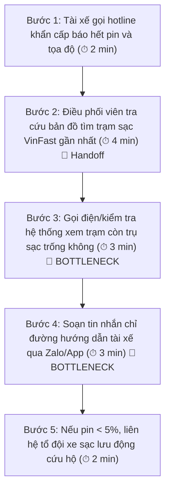
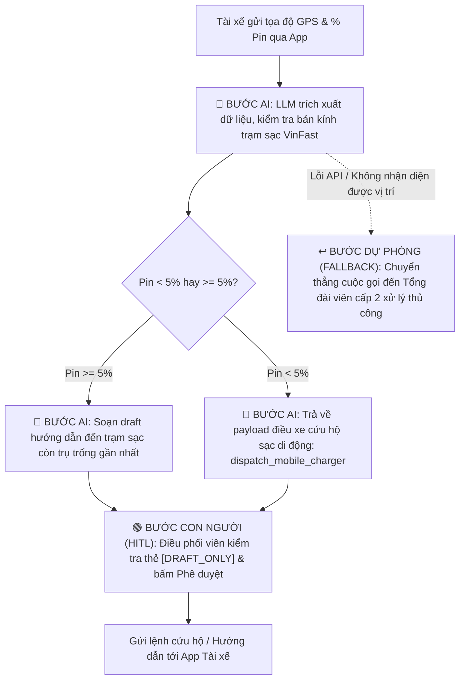

# Phase 3 — DEEP-DIVE & Phase 5 — EVALUATE
**Dự án:** Trợ lý Điều vận Cứu hộ Pin Thông minh (GSM Intelligent Battery Dispatcher)  
**Đơn vị phát triển:** AI Product Team — Vin Smart Future (Tập đoàn Vingroup)  
**Tác giả thực hiện:** Dương (Branch: `duong`) & Nhóm Dự án  
**Deliverable:** Báo cáo Phân tích sâu & Đánh giá Quyết định đầu tư (Lab 02: AI Product Scoping)

---

## 🏛️ 1. Bối cảnh Nghiệp vụ & Đơn vị Áp dụng

* **Đơn vị thành viên:** **Công ty Cổ phần Di chuyển Xanh và Thông minh GSM (Taxi điện Xanh SM)** kết hợp cùng hệ sinh thái trạm sạc xe điện **VinFast**.
* **Bài toán thực tế:** Vào các khung giờ cao điểm (mưa bão, tan tầm), tần suất xe taxi điện Xanh SM cạn pin giữa đường hoặc báo pin nguy cấp (< 10%) tăng đột biến. Quy trình điều phối cứu hộ hiện tại hoàn toàn phụ thuộc vào việc điều phối viên trực tổng đài tra cứu bản đồ thủ công, dẫn đến tình trạng quá tải, chậm trễ điều xe và nguy cơ xe chết máy trên cầu hoặc giữa các trục đường lớn.

---

## 🗺️ 2. Quy trình Vận hành Hiện tại (Current-State Workflow Mapping)

Quy trình xử lý sự cố hết pin thực địa hiện tại gồm 5 bước thủ công:

* **Tổng thời gian xử lý thủ công trung bình:** **14 phút / sự cố**.
* **Điểm chuyển giao thông tin (🔄 Handoff):**
  - Giữa Tài xế ngoài hiện trường và Điều phối viên trung tâm qua cuộc gọi thoại.
  - Giữa Điều phối viên và Đội xe sạc pin di động (Mobile Charging Vehicle) qua điện thoại bàn.
* **Điểm nghẽn cổ chai (🔴 Bottlenecks):**
  - **Bước 3:** Việc kiểm tra trụ sạc trống bị phân mảnh, điều phối viên phải chuyển đổi qua lại giữa nhiều ứng dụng quản lý trạm sạc VinFast.
  - **Bước 4:** Soạn tin nhắn thủ công dễ gõ nhầm địa chỉ hoặc ước lượng sai quãng đường còn lại của xe.

---

## 📋 3. Problem Statement 6-Field (Báo Cáo Bài Toán Chuẩn)

| Trường thông tin (Field) | Chi tiết phân tích kỹ thuật & nghiệp vụ |
| :--- | :--- |
| **1. Actor / Operator** | Điều phối viên trung tâm vận hành Xanh SM (GSM Dispatcher) phối hợp cùng Tài xế taxi điện VinFast VF5 / VF8 / VF9. |
| **2. Current Workflow** | Nhận điện thoại SOS từ tài xế ➔ Tra cứu vị trí GPS ➔ Đối chiếu trạm sạc VinFast khả dụng ➔ Soạn tin nhắn hướng dẫn hoặc gọi đội cứu hộ lưu động. |
| **3. Bottleneck** | Mất từ 12 - 15 phút xử lý mỗi cuộc gọi; điều phối viên bị quá tải vào giờ cao điểm; nguy cơ đề xuất trạm sạc quá xa khiến xe chết máy giữa đường phố. |
| **4. Business Impact** | Mỗi cuốc xe bị đình trệ làm giảm doanh thu 150.000 VNĐ; chi phí cẩu kéo xe chết máy tốn 1.200.000 VNĐ/lần; gây ùn tắc giao thông ảnh hưởng trực tiếp đến uy tín thương hiệu Vingroup. |
| **5. Success Metric** | **Thời gian điều phối (Dispatch SLA):** Giảm từ **14 phút** xuống **dưới 2 phút**. **Tỉ lệ sự cố được cứu hộ thành công không chết máy:** Đạt **>= 98%**. **Mức độ hài lòng của tài xế (CSAT):** Tăng từ 3.2 lên **>= 4.6 / 5.0**. |
| **6. Operational Boundary** | **Được phép:** Tự động tra cứu bán kính trạm sạc, tính toán ranh giới dung lượng pin, draft sẵn tin nhắn chỉ đường. **TUYỆT ĐỐI CẤM:** Cấm tự động gửi tin nhắn cho tài xế mà không có xác nhận duyệt của con người (`[DRAFT_ONLY]`); Cấm gợi ý trạm sạc xa $> 5\text{ km}$ khi pin $< 5\%$ (bắt buộc kích hoạt xe cứu hộ). |

---

## ⚡ 4. Quy trình Vận hành Tương lai (Future-State Flow & AI Fit)

### 4.1. Phân tích Mức độ Tích hợp AI (AI-Fit Matrix)
* **Không dùng No-AI / Pure Rule:** Vì thông tin phản ánh từ tài xế thường lẫn tạp âm, mô tả vị trí tự nhiên qua giọng nói/chat tiếng Việt cần LLM để trích xuất ngữ cảnh.
* **Không dùng Autonomous Multi-Agent:** Rủi ro quá lớn khi để các Agent tự động ra lệnh điều xe trên đường phố thực mà không có sự kiểm soát của con người.
* **Lựa chọn tối ưu: `LLM Feature Co-pilot + Rule Safety Guardrails`:**
  - LLM trích xuất vị trí, tóm tắt tình trạng và soạn bản nháp chỉ đường chuẩn hóa.
  - Rule-based Engine khóa cứng ranh giới dung lượng pin (< 5% thì chặn điều xe đi xa).
  - Điều phối viên đóng vai trò Human-in-the-loop (HITL) duyệt tin nhắn cuối cùng.

### 4.2. Sơ đồ Future-State Flow:

---

## 🎯 5. Phase 5 — EVALUATE: Đánh Giá Độ Sẵn Sàng & Quyết Định Đầu Tư

### 5.1. AI Readiness Checklist:
* [x] **Dữ liệu:** VinFast và GSM đã có sẵn API thời gian thực đo đếm dung lượng pin (BMS Telematics) và trạng thái trụ sạc VinFast (Occupancy API).
* [x] **Kiểm soát rủi ro:** Có cơ chế Human-in-the-loop (`[DRAFT_ONLY]`) và Fallback tự động về nhân sự khi có lỗi mạng/API.
* [x] **Sự sẵn sàng của vận hành:** Đội ngũ điều phối viên Xanh SM đã quen sử dụng giao diện Dashboard điều vận.

### 5.2. Quyết định của Ban Dự án Vin Smart Future:
* [x] **GO (Bắt đầu triển khai Prototype thử nghiệm)**
* [ ] **NOT YET**
* [ ] **NO-GO**

### 5.3. Lập luận chứng minh (Justification):
1. **Hiệu quả kinh tế rõ ràng:** Giảm thời gian xử lý từ 14 phút xuống dưới 2 phút giúp mỗi điều phối viên xử lý gấp 5 lần số lượng sự cố khẩn cấp, tiết kiệm hàng trăm giờ lao động mỗi tháng.
2. **Chi phí phát triển thấp & an toàn tuyệt đối:** Sử dụng mô hình nhẹ **Gemini 2.5 Flash** với latency cực thấp (< 1.5s), chi phí token không đáng kể so với thiệt hại của việc xe cứu hộ chậm trễ.
3. **Bảo vệ thương hiệu Vingroup:** Loại bỏ hoàn toàn sự cố xe taxi điện chết máy giữa đường phố giờ cao điểm, củng cố cam kết chất lượng dịch vụ chuẩn 5 sao của Xanh SM.
